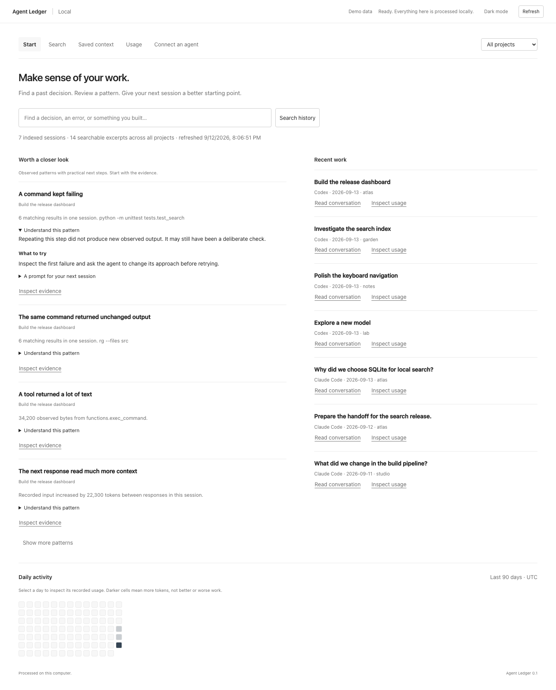

# Agent Ledger

**Understand your agent's work. Recover the context worth keeping.**

A local workspace for Claude Code and Codex history. Start with understandable usage findings, search past conversations, and save useful decisions for your next session. Optionally let your coding agent retrieve that context through a read-only MCP connection.

No website, hosted service, account, model subscription, or build step. Clone the public source and run it on your computer. MIT licensed; Python 3.10+ and its standard library, including SQLite FTS5.



## Run locally

In the cloned repository directory:

```sh
python3 ledger.py
```

Windows: `py -3 ledger.py`. If `python3` is unavailable, use your Python 3 command. Keep the terminal running; **Ctrl+C** stops the app. It opens a local browser tab. If that fails, paste the full URL printed in the terminal, including its temporary access fragment.

To explore without reading any real history:

```sh
python3 ledger.py --demo
```

Demo mode uses generated Claude and Codex examples in a temporary directory, removed on normal exit. Saving notes in demo mode is temporary too.

## Three useful starting points

**“What should I change next time?”** Open Start and expand a pattern under **Worth a closer look**. Each finding explains the observation, what it might mean, and one next step. Inspect the evidence before acting. Copy a suggested prompt into your next agent session if it fits. Repetition can be deliberate; findings are not proof of waste or promised savings.

**“Why did we build it this way?”** Search a feature, error, or decision. Search matches all entered words in bounded conversation excerpts and saved context. Open a result, read nearby messages, and use Earlier/Later to browse. Save a takeaway in your own words, with the source citation retained.

**“How can my next session remember this?”** Add a project note under Saved context, or load a text/Markdown file into the editor and review it before saving. Notes can be edited and deleted. Connecting an agent is optional; you can read and use the notes yourself.

The project selector scopes all views. Global saved notes remain available within a project. Start shows recent sessions even if token usage is missing. Its daily grid covers the last 90 UTC dates; selecting a day opens Usage with that day's filter. Usage defaults to 30 UTC dates and supports model, session, turn, and descendant inspection.

## Optional agent connection

Open **Connect an agent** in the app for the exact local command and argument list, or print a configuration:

```sh
python3 ledger.py --mcp-config
```

Add it to your client's local / stdio MCP server settings. The generated JSON uses the common `mcpServers` wrapper; other clients may use a different configuration format with the same command and arguments. This app never edits your agent settings, installs hooks, or starts an AI model.

Your client starts a small background subprocess and communicates through stdin/stdout. The browser app does not need to remain open. The subprocess exits when the client closes its input or terminates it. Five tools are available:

| Tool | Purpose |
| --- | --- |
| `search_history` | Find conversation excerpts and saved context |
| `read_context` | Expand a citation with nearby messages |
| `project_notes` | Retrieve project and global notes |
| `recent_sessions` | Find recent recorded work |
| `usage_findings` | Get evidence and suggested next steps |

Try: **“Use Agent Ledger to find why we chose this approach. Read the relevant excerpts and cite your sources.”** Or: **“Read this project's saved context before we continue.”**

All MCP tools are read-only. They do not execute transcript instructions, run commands, or modify notes. **Your connected agent may send retrieved context to its model provider.** Local storage does not make that model local. Redaction removes common secret patterns but does not anonymize your work.

The MCP process reads the last completed index. To include new work, click **Refresh**, run `python3 ledger.py --import-only`, or keep the browser app running with `python3 ledger.py --watch 60`. Watching performs local incremental scans; it makes no model calls and stops with the app. Reload a view after a background refresh to see its newest data.

## Import controls

```sh
python3 ledger.py --help
python3 ledger.py --no-open
python3 ledger.py --codex-home /path/to/codex --claude-home /path/to/claude --cache-dir /path/to/private-cache
python3 ledger.py --no-claude
python3 ledger.py --import-only
python3 ledger.py --add /path/to/decisions.md --project /path/to/project
```

- Codex: `--codex-home`, then `CODEX_HOME`, then `~/.codex`; reads only JSONL under `sessions/` and `archived_sessions/`.
- Claude Code: `--claude-home`, otherwise `~/.claude`; reads JSONL under `projects/`, including subagent transcripts. Use `--no-claude` to exclude it.
- No credential, authentication, or agent-configuration files are imported. Symlinked transcript files and nested directories are skipped. Source logs are never edited.
- Cache: `~/Library/Caches/agent-ledger` on macOS; `$XDG_CACHE_HOME/agent-ledger` or `~/.cache/agent-ledger` on Linux; `%LOCALAPPDATA%\agent-ledger` on Windows. Each combination of history roots gets a separate database. Changing roots also changes which saved notes are visible.
- The cache includes private excerpts and saved notes. Keep it outside Git and public/synced folders. POSIX files use owner-only permissions; Windows uses normal user-directory ACLs. Back up the private database if your notes matter. Removing the cache removes notes as well as the index.
- Long JSONL records are skipped above 8 MiB by default (`--line-limit-mib`). Searchable text is bounded to 16,000 characters per message; tool previews default to 4,096 (`--preview-chars`). Coverage notes explain skipped records.

If nothing appears, try All projects / All dates, check the history paths, and Refresh. Cursor, cloud-only sessions, other computers, image content, and encrypted reasoning are not supported in this release.

## What the usage numbers mean

Input includes context read again, not just new text typed by you. Cached input is a subset of input; reasoning output, when recorded, is a subset of output. Claude's ordinary input, cache reads, and cache creation are converted to inclusive input once. A streamed Claude message is counted once; conflicting source appearances are excluded. Older Codex cumulative counters remain session-level evidence instead of invented individual responses.

Codex credit estimates use a dated, bundled [rate reference](lens/rates.json) and Decimal arithmetic. They are **not account charges, subscription remaining balances, or dollar estimates**. Unknown models/providers and Claude usage have no Codex credit conversion. Partial or unavailable amounts remain labeled. Tool-result bytes are not billed tokens, and chronological association does not establish causation.

Session totals can overlap when transcripts contain copied responses; combined totals union known response identities. Unknown missing work remains unknown. See [accounting specification](docs/SPEC.md) for the conservative limits.

## Development and release checks

```sh
python3 -m unittest discover -s tests -v
python3 scripts/large_file_smoke.py --mib 64
python3 scripts/check_public_tree.py
python3 scripts/build_release.py
```

Optional browser checks require Playwright, only for development:

```sh
node scripts/browser_smoke.cjs
node scripts/workspace_smoke.cjs
```

The optional `scripts/mcp_smoke.mjs` tests interoperability with the official TypeScript MCP SDK; set `MCP_SDK_ROOT` to that installed package directory. None of these development tools are required to run the app.

See [validation](docs/VALIDATION.md), [architecture](docs/ARCHITECTURE.md), and [security](SECURITY.md). Public fixtures and screenshots are synthetic. Do not attach real transcripts, databases, connection configurations with personal paths, or private screenshots to issues.

Agent Ledger combines the context-recovery ideas from an earlier local memory prototype with the accounting engine originally developed as Codex Usage Lens. `report.py` remains a compatible launcher. The app is independent of agent vendors and does not guarantee that future transcript formats will remain compatible.
